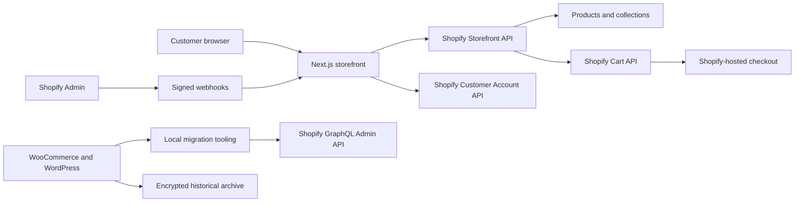

# ProSporter WooCommerce to Shopify and Next.js Execution Plan

> Repository scope: ProSporter ecommerce only. Do not use this plan or repository for any separate marketing site, club site, CMS, social feed, sports-data feed, or other deliverable from the wider agreement.

## 1. Purpose

This plan turns the Phase 2 obligations in the project Schedule into an executable migration and launch runbook. It assumes:

- The current ProSporter site at `https://prosporter.com.au` is the source WooCommerce/WordPress store.
- The repository contains a conceptual Next.js storefront that establishes the visual direction and information architecture, but is not production commerce code.
- WordPress administrator access is available.
- The client will own the Shopify account, domain, analytics property, and payment accounts.
- Historical WooCommerce orders will be archived, not imported into Shopify.

The Schedule remains authoritative. This plan explains how to deliver it and does not expand the commercial scope.

## 2. Required outcomes

The work is complete when all of the following are true:

1. Shopify is the source of truth for products, variants, inventory, pricing, discounts, customers, shipping, tax, payments, carts, checkout, and new orders.
2. The Next.js application serves the customer-facing storefront on the existing ProSporter domain.
3. Published WooCommerce products, content, SEO metadata, and customer records have been migrated and reconciled.
4. Every relevant legacy product, category, page, and post URL has a verified destination or an intentional retirement decision.
5. Historical orders, payments, refunds, fulfilments, tracking data, and applicable attachments are delivered as a readable archive outside Shopify.
6. A live end-to-end order proves variant selection, price, stock, discount, shipping, tax, payment, confirmation, and order creation.
7. The contractual performance, browser, responsive, SEO, analytics, link, security, and console-error criteria pass with evidence.
8. Cutover, rollback, handover, backup, monitoring, and the 30-day warranty process are documented.

## 3. Verified baseline

### 3.1 Contract baseline

Phase 2 includes the frontend storefront, Shopify configuration, WooCommerce migration, DNS and deployment, migration reconciliation, historical-order archive, testing, handover, and a 30-day warranty. The contractual delivery target is 10 business days from Kickoff, followed by a 7-day Review Period and go-live within 3 business days after written acceptance.

### 3.2 Live WordPress discovery snapshot

The following public, read-only observations were recorded on 3 September 2026. They are discovery indicators only. The authenticated export at Kickoff is the migration source of truth.

| Observation | Public snapshot |
| --- | ---: |
| Published products exposed by the WooCommerce Store API | 141 |
| Products reporting options | 138 |
| Variation references in the public product responses | 861 |
| Products reporting in-stock | 135 |
| Products reporting on-sale | 0 |
| Products returning no image objects in the public Store API | 44 |
| Currency | AUD |
| WordPress pages returned by the public REST API | 27 |
| WordPress posts returned by the public REST API | 15 |
| WooCommerce product categories returned by the public Store API | 25 |

The image count is a risk signal, not proof that 44 products have no usable images. The authenticated media and product export must determine whether images are missing, plugin-managed, inaccessible to the Store API, or intentionally absent.

### 3.3 Repository baseline

The current repository is a conceptual prototype:

- Next.js `16.2.7`, React `19.2.4`, TypeScript, and Tailwind CSS 4.
- Static home, product, and catch-all shop routes.
- Responsive header, mobile navigation, footer, collection filtering/sorting, product cards, product detail view, and cart drawer.
- A designed taxonomy separating product type, surface, club/team, gender, colour, and size.
- Local JSON containing 94 modeled products and 470 size-option entries.
- Local product images and hero artwork.
- A browser-local cart whose checkout button points back to the WooCommerce cart without transferring its lines.

The repository currently has no Shopify dependency or Storefront API layer, Admin API migration tooling, real Shopify cart, customer account flow, functional search, content/blog routes, analytics, sitemap, robots route, redirect map, webhooks, deployment configuration, automated tests, or handover documentation.

The prototype lint and production build both pass after dependencies are installed. The dependency audit currently reports 7 high-severity advisories, including the direct Next.js dependency and transitive dependencies. Upgrade Next.js to a patched compatible release before production work, then rerun lint, type checking, build, tests, and the audit.

### 3.4 Consequence of the baseline

The local catalog must never be used as the migration input. It trails the live public catalog by 47 products and does not model real Shopify variant IDs, inventory quantities, descriptions, galleries, compare-at prices, weights, barcodes, taxability, shipping requirements, or SEO fields. Retain the prototype as a design and interaction reference; replace its commerce data and state layers.

## 4. Scope controls and approval gates

### 4.1 Included migration entities

- Products and variants
- Product and variant images
- Point-in-time inventory
- Collections/categories
- Static pages
- Blog posts and embedded images
- Page titles and meta descriptions
- 301 redirects
- Active discount codes
- Shipping zones and rates
- Tax configuration
- Shopify Payments and any client-nominated gateway
- Customer records, excluding passwords
- Historical-order archive, reconciliation, and applicable attachments

### 4.2 Explicit exclusions

- Historical-order import into Shopify
- Copywriting or new content creation
- New brand identity, custom photography, video, or illustration
- Ongoing SEO or marketing
- Unnamed ERP, CRM, accounting, fulfilment, or email-marketing integrations
- Multi-language or multi-currency configuration
- Native mobile apps
- Paid app configuration beyond initial installation unless separately approved
- Formal WCAG AA conformance work beyond the contracted semantic structure

### 4.3 Decisions requiring written client approval

Record these by email because WhatsApp does not constitute contractual approval:

1. Shopify customer-account mode and customer communication approach.
2. Final navigation, collection mapping, and any product/category retirement.
3. Correct values for ambiguous categories, attributes, variants, SKUs, and missing imagery.
4. Shipping rates, free-shipping threshold, tax behavior, payment gateways, and test/refund procedure.
5. Active discount codes to recreate.
6. Final customer invitation or account-transition message and send time.
7. Production domain, checkout domain, DNS window, and maintenance message.
8. Any paid Shopify app or other recurring third-party cost.
9. UAT acceptance and the final go-live authorization.

## 5. Target architecture



### 5.1 Platform responsibilities

| Layer | Responsibility |
| --- | --- |
| Shopify Admin | Commerce source of truth, staff operations, products, variants, inventory, customers, discounts, shipping, tax, payments, orders, and fulfilment |
| Shopify Storefront API | Customer-facing catalog reads, product availability, cart mutations, buyer identity, discount codes, and checkout URL |
| Shopify Customer Account API | Customer sign-in and authenticated customer data if the modern account mode is selected |
| Shopify hosted checkout | Shipping selection, tax, payment, confirmation, and new-order creation |
| Next.js | Storefront pages, navigation, search UI, filters, product rendering, cart UI, content pages, SEO, analytics, error handling, and redirects |
| Hosting provider | Next.js runtime, environment variables, preview deployments, logs, backups of app configuration, and uptime checks |
| WordPress/WooCommerce | Read-only migration source and post-cutover archive until written decommission approval |

### 5.2 API and account choices

- Install Shopify's Headless sales channel and publish products to it.
- Pin Shopify APIs to the dated `2026-07` version for the implementation, rather than using an unpinned `latest` endpoint.
- Use the Storefront API for buyer-facing product/cart requests.
- Use a server-only Admin API token for migration jobs and administrative webhooks. Never expose it through a `NEXT_PUBLIC_` variable or return it to a browser.
- Prefer direct, typed GraphQL operations in a small repository-owned data layer. Add a large SDK only if it removes a demonstrated implementation risk.
- Validate Shopify webhook HMAC signatures before triggering cache invalidation.
- Tag cached catalog responses by product/collection and revalidate on signed Shopify product, inventory, and collection events. Also keep a short time-based fallback revalidation window.
- Use Shopify cart IDs and merchandise variant IDs. Do not map a cart line by product slug plus display size.
- Redirect checkout through the Shopify cart `checkoutUrl`; Shopify documents this as the handoff to its hosted checkout.

### 5.3 Customer account decision

This must be resolved at Kickoff:

- The Schedule assumes migrated customers are deactivated, receive invitations, and set a new password. This matches Shopify's legacy customer-account workflow.
- Shopify's current customer accounts use passwordless email verification codes and the Customer Account API. In that mode, the user does not set a replacement password.

Recommended default: use current customer accounts with the Customer Account API for a new headless build, because Shopify hosts the authentication and it avoids handling passwords. Before doing so, obtain written confirmation that a passwordless transition satisfies the Schedule's intended customer-reset obligation. If the client requires legacy invitations and passwords, implement the legacy flow and test activation, login, logout, password reset, account links, and checkout identity end to end.

### 5.4 Secret and personal-data rules

- Create named, migration-only WordPress and Shopify credentials with the minimum permissions required.
- Store secrets in the deployment platform's encrypted environment store and a password manager, not `.env` files committed to Git.
- Keep raw customer and order exports outside the repository in an encrypted working directory.
- Do not log customer payloads, addresses, access tokens, payment transaction details, or full webhook bodies.
- Limit access to the people performing the migration.
- Revoke migration credentials after handover.
- Delete working copies of personal data at the contractual retention deadline; retain only the client-owned handover archive as instructed.

## 6. Migration data model

Every destination record must retain a stable trace to its WooCommerce source, preferably in migration manifests and a private Shopify metafield such as `migration.woo_id`.

| Source entity | Shopify destination | Required mapping and checks |
| --- | --- | --- |
| Woo product | Product | Woo ID, title, handle, full description HTML, vendor, product type, status, tags, SEO title/description, publication state |
| Woo variation | Product variant | Woo variation ID, unique SKU, option names/values, price, compare-at price, weight, barcode, taxability, shipping requirement, inventory policy |
| Featured/gallery image | Product media | Original URL/file, alt text, display order, product association, variant association where present, checksum |
| Stock | Inventory item at Shopify location | Exact cutover quantity, stock-management status, backorder policy, location, source timestamp |
| Categories | Manual or smart collections | Approved mapping into product-type, surface, and club/team axes; collection handle and SEO |
| Attributes/tags | Options, tags, and metafields | Normalize colour, gender, apparel size, numeric/sock size, surface, and club/team without losing raw source values |
| WordPress page | Shopify page plus Next.js route | Slug, title, body HTML, images, SEO, canonical decision, publication state |
| WordPress post | Shopify blog article plus Next.js route | Slug, title, body, excerpt, author, publish date, images, tags/categories, SEO |
| Yoast metadata | Shopify SEO fields and Next metadata | SEO title, meta description, canonical decision, Open Graph image; preserve source URL in redirect manifest |
| Woo coupon | Shopify discount | Active date range, code, fixed/percentage/free-shipping behavior, minimums, product/category restrictions, usage limits |
| Woo customer | Shopify customer | Woo user/customer ID, name, email, phone, default address, marketing consent and timestamp, tax exemption, approved tags; never password hash |
| Woo order | Archive CSV only | Full order header, addresses, totals, status, dates, currency, customer reference |
| Woo order line | Archive CSV only | Order reference, product/variation IDs, SKU, name, quantity, subtotal, discount, tax, total |
| Payment/refund | Archive CSV only | Order reference, method, transaction reference, amount, currency, date/status; refund reason and affected lines where available |
| Fulfilment/tracking | Archive CSV only | Order reference, status/date, carrier, tracking number/URL, fulfilled lines |
| Invoice/packing slip | Archive file | Original file, order link, stable filename, checksum, readable-file verification |

## 7. Catalog normalization rules

Apply the existing information architecture as a proposed mapping, then validate it against the authenticated 141-product-or-later export.

1. Separate product type, playing surface, club/team, gender, colour, and size. Do not flatten these axes into one category list.
2. Merge `Color` and `Colour` into `Colour`.
3. Normalize `Navy Blue` to `Navy`, and `Gray`/`Light Gray` to an approved `Grey` value unless merchandising requires distinct swatches.
4. Normalize gender synonyms such as `Male`/`Men` and `Female`/`Women`.
5. Normalize apparel sizes such as `XXL` to `2XL`, `3X` to `3XL`, and `SM` to `S/M`.
6. Keep numeric sock sizing separate from apparel sizing.
7. Assign every product an approved primary product type; escalate ambiguous items rather than inferring silently.
8. Fold legacy singleton categories into approved parent collections.
9. Preserve every original category, attribute, and source ID in the transformation report for traceability.
10. Reject or manually review duplicate/missing SKUs, duplicate handles, invalid prices, impossible stock values, variants with no option value, products with no sellable variants, broken image URLs, and unsupported HTML.
11. Do not publish migrated products until reconciliation and merchandising review are complete.

## 8. Detailed execution workstreams

### Workstream 0 - Kickoff, access, and safety

#### Tasks

- Confirm the Schedule is signed and Kickoff has occurred.
- Obtain written confirmation of the primary client approver and approval email.
- Confirm owner access to WordPress, WooCommerce, Shopify, domain/DNS, hosting, analytics, and payment gateways.
- Create a dedicated WordPress migration account or application password and WooCommerce REST API key. Do not reuse the owner's everyday password.
- Create a client-owned Shopify development/transfer store if the final store does not exist.
- Create a custom Shopify app or approved access method with only required Admin API scopes.
- Install the Headless channel and create separate Storefront credentials for development, preview, and production where supported.
- Record the current DNS zone and reduce TTL before cutover.
- Take and verify a restorable WordPress database and `wp-content/uploads` backup before any source-side cleanup.
- Create an encrypted, access-controlled working location for exports and archive artifacts.
- Confirm the migration contact window and the client's availability for decisions.

#### Exit criteria

- All required systems are accessible.
- No secret or personal export is committed to Git.
- A source backup can be restored or has been verified by the current host.
- Account mode, target domain, Shopify store, and approver are recorded.

### Workstream 1 - Authenticated WordPress and WooCommerce audit

#### Tasks

Export or inspect the following using WordPress admin, WooCommerce reports/export, REST APIs, the database when necessary, and the media filesystem:

- All product statuses, including published, draft, private, scheduled, and trashed.
- Products, variations, SKUs, prices, sale dates, tax classes, dimensions, weights, stock, backorders, sold-individually flags, upsells/cross-sells, and purchase notes.
- Global and custom attributes, categories, tags, brands, and plugin-provided product metadata.
- Product galleries, variation images, image alt text, attachment IDs, original files, and broken/missing media.
- Pages, posts, authors, publish dates, revisions if needed, embedded media, shortcodes, forms, and internal links.
- Yoast titles, descriptions, canonical values, Open Graph fields, sitemap URLs, redirects, and index/noindex state.
- Customers, addresses, marketing consent evidence, tax settings, roles, duplicate emails, and guest purchasers.
- Active and scheduled coupons plus restrictions and usage limits.
- Shipping zones, methods, rates, classes, postcode rules, and free-shipping logic.
- Tax settings, tax classes/rates, price-inclusive behavior, and rounding behavior.
- Payment methods, live/test status, settlement currency, express wallets, fraud rules, and required client verification.
- Order statuses and the plugins/data sources used for payment, refund, invoice, fulfilment, carrier, and tracking metadata.
- Every installed plugin that affects catalog, checkout, pricing, shipping, tax, payment, customer accounts, SEO, redirects, analytics, consent, email, or fulfilment.
- Total database order count and the highest source order ID at the time of extraction.

#### Outputs

- `source-inventory.json` with counts by entity and status.
- `plugin-and-integration-register.md` with replacement, retirement, or out-of-scope decision for each relevant plugin.
- `data-quality-report.csv` listing record ID, issue, severity, owner, resolution, and status.
- `url-inventory.csv` containing source URL, type, status, canonical, traffic priority if available, and proposed destination.
- `media-inventory.csv` containing source record, URL/path, attachment ID, bytes, checksum, alt text, and validation status.
- Source backup manifest with timestamp, record counts, file checksum, and restore owner.

#### Exit criteria

- Authenticated counts replace all public estimates.
- Every source data type has an owner and destination/exclusion decision.
- Critical data quality issues have a written resolution.

### Workstream 2 - Shopify foundation

#### Tasks

- Set legal business details, store address, AUD currency, Australian market, timezone, order IDs, customer email sender, and notification recipients.
- Create the real inventory location(s) and confirm fulfilment ownership.
- Configure shipping zones/rates and free-shipping thresholds to match the approved WooCommerce behavior.
- Configure tax behavior to match the approved source settings; the client confirms the business/tax treatment.
- Complete Shopify Payments verification and configure any client-nominated gateway and wallets.
- Configure test mode and define how the live test order will be paid, fulfilled, refunded, and documented.
- Configure customer accounts according to the written decision in section 5.3.
- Install Headless, create the storefront, assign API scopes, and publish test products to the headless sales channel.
- Configure the checkout/customer-account domain strategy so customers move from the Next.js storefront to Shopify-hosted checkout without an unexpected or untrusted domain.
- Create a minimal Online Store theme/fallback configuration because the handover clause requires Shopify theme files and configuration export even though Next.js is the primary storefront.
- Implement daily automated backups of storefront configuration and any project-owned data with 30-day rolling retention. Select a Shopify data-export or backup method and obtain written approval before introducing any paid app.
- Record all third-party components, licence types, owners, and recurring costs.

#### Exit criteria

- Shopify can complete a test product checkout independently of Next.js.
- Shipping, tax, payments, customer accounts, notifications, and locations have client-approved settings.

### Workstream 3 - Repeatable migration pipeline and dry run

#### Implementation rules

- Build scripts under `scripts/migration/` and keep them deterministic, restartable, and idempotent.
- Pin the API version and log the script version, source snapshot timestamp, and target store.
- Store sensitive inputs/outputs outside Git; commit only schemas, redacted samples, scripts, and reports.
- Use source IDs, SKUs, and destination IDs in a mapping manifest to prevent duplicates on rerun.
- Produce structured errors per record and fail the quality gate on unresolved critical errors.
- Use Shopify GraphQL Admin bulk operations where beneficial. For this catalog size, correctness and rerun safety matter more than maximum throughput.
- Keep products in draft during dry runs.

#### Load order

1. Taxonomy definitions, Shopify metafield definitions, and empty manual collections.
2. Products, options, variants, base prices, source identifiers, and draft status.
3. Product media and variant-media associations.
4. Inventory items, locations, and non-final staging quantities.
5. Collection membership, tags, product types, and metafields.
6. Pages, blogs, articles, and policy content.
7. Customers without passwords; preserve consent only when evidence is valid.
8. Active discounts.
9. Redirects after destination handles are final.
10. Final publication to the Headless channel after QA.

#### Dry-run reconciliation

Compare source and destination for:

- Product count by publication status
- Variant count by product and total
- SKU set, uniqueness, and null count
- Image count by product, checksums where possible, and failed media
- Collection count and membership
- Price, compare-at price, currency, and taxability
- Inventory item count and staging quantities
- Page and post count
- SEO title/description population
- Customer count, unique emails, addresses, consent flags, and failed records
- Active discounts and their conditions

Sample at minimum every exception plus representative simple, variable, club, indoor, beach, out-of-stock, discounted, free-shipping, and tax-relevant cases. For a catalog this size, automate a complete field-level comparison rather than relying only on samples.

#### Exit criteria

- Dry run completes without duplicate creation.
- Re-running produces no unintended changes.
- All count differences are explained or corrected.
- Client signs off on the merchandising sample and taxonomy decisions.

### Workstream 4 - Productionize the Next.js storefront

#### Foundation

- Upgrade Next.js and related packages to patched compatible versions; refresh the lockfile intentionally.
- Add `.env.example` containing variable names only.
- Add a server-only Shopify configuration module that validates required environment variables at startup.
- Add typed Storefront GraphQL fragments and one request wrapper with timeouts, error normalization, request IDs, and cache tags.
- Add structured application logging without personal data or secrets.
- Add not-found, error, loading, and empty states.
- Add CI for install, lint, type check, tests, build, dependency audit policy, and secret scanning.

#### Replace mock catalog reads

- Replace `mock-data/catalog.json` and `src/lib/catalog.ts` runtime reads with Shopify queries.
- Retain local mock data only as fixtures for tests/Storybook-style development, clearly named as fixtures.
- Query complete product details: handle, title, description, SEO, media, options, selected variants, price ranges, compare-at prices, availability, inventory policy, collections, product type, tags, and required metafields.
- Add cursor pagination rather than assuming the whole catalog fits in one static payload.
- Use stable collection handles from the approved mapping.
- Decide whether filters use Shopify's predictive/search APIs or storefront-side filtering; ensure counts and URLs remain correct at 141-plus products.

#### Routes and page behavior

Implement and verify:

- `/` - Shopify-backed homepage content and products.
- `/shop` - all-products listing with pagination.
- `/shop/<collection-handle>` - category, surface, club/team, sale, and new-arrival collections.
- `/product/<product-handle>` - keep this shape if it minimizes legacy redirects.
- `/search` - functional text search with keyboard access, empty state, and no-results state.
- `/cart` plus the cart drawer - the page provides a durable and accessible fallback to the drawer.
- `/account` and callback/logout routes appropriate to the selected Shopify account mode.
- Static content and policy routes for all approved migrated pages.
- Blog index, article routes, author/date presentation, and embedded media.
- Purpose-built 404 page and intentional redirects for obsolete paths.

#### Product and variant correctness

- Select actual Shopify variants by option combination, not a display-only size string.
- Update price, compare-at price, media, SKU, and availability when options change.
- Disable impossible and unavailable option combinations.
- Remove the prototype quick-add behavior that silently chooses the middle size. Quick add may add only products with one unambiguous sellable variant; otherwise it opens an option selector or the product page.
- Respect sold-out and backorder policy from Shopify.
- Display all approved gallery media with optimized dimensions, alt text, and stable aspect ratio.
- Link the real size guide or remove the inactive control until the guide exists.
- Render migrated descriptions instead of generated placeholder descriptions.

#### Real Shopify cart and checkout

- Create and persist a Shopify cart ID using a secure browser cookie or equivalent durable client state.
- Implement cart create, fetch, line add, line update, line remove, buyer identity, discount-code update, and recovery from expired/invalid cart IDs.
- Always send Shopify merchandise variant IDs and quantity.
- Treat Shopify-returned cost and availability as authoritative; do not calculate production totals from stale local prices.
- Display user-facing mutation errors and prevent double submissions.
- Verify cart persistence across refresh, navigation, device viewport changes, and authenticated account transitions.
- Send the customer to the cart's Shopify `checkoutUrl`.
- Confirm discount, shipping, tax, payment, confirmation, notification, and resulting Shopify order in a live end-to-end test.

#### Customer accounts

- Implement the selected Shopify-hosted login/authorization flow.
- Protect OAuth/PKCE state, callback validation, tokens, and logout behavior.
- Keep buyer tokens in secure, HTTP-only storage when the selected flow permits; never log them.
- Link account, orders, addresses, returns/support, and logout appropriately.
- Test a migrated customer, a new customer, a guest checkout, duplicate email handling, expired login/activation flow, and checkout identity handoff.
- Do not send customer invitations or transition emails until the client gives written approval of the content and send time.

#### Content, SEO, analytics, and links

- Generate a unique title and meta description for every product, collection, page, and article.
- Add canonical URLs and Open Graph/Twitter metadata.
- Add valid Product, BreadcrumbList, Organization, and Article structured data where applicable.
- Generate `sitemap.xml` for all indexable Next.js routes and a deliberate `robots.txt`.
- Keep preview/staging deployments `noindex` and block indexing until production cutover.
- Install GA4 on the client-owned ProSporter property and validate page view, view item, add to cart, begin checkout, and purchase events with no duplicate events.
- Preserve approved consent behavior and avoid sending personal data in analytics fields.
- Rebuild, replace, or intentionally retire every source form found during the WordPress audit, including contact and order-service request forms. Included forms must submit server-side, validate input, resist spam, expose useful error states, and deliver to the client-nominated address.
- Crawl all internal links and media URLs and fix every unintended 4xx/5xx response.

#### Performance, accessibility, and browser quality

- Use server-rendered content for catalog landing pages and product pages where practical.
- Control image dimensions and `sizes`, preload only the actual above-the-fold image, and avoid eager-loading product grids.
- Minimize client components and third-party scripts.
- Prevent layout shift in product cards, galleries, navigation, and cart.
- Make menus, dialogs, filters, variant selectors, search, and cart fully keyboard operable with visible focus.
- Trap focus and restore it correctly for the cart drawer, mobile menu, and filter sheet.
- Add meaningful labels, headings, landmarks, error announcements, alt text, and reduced-motion behavior.
- Test the contracted widths and current stable Chrome, Safari, Firefox, and Edge.

#### Exit criteria

- No runtime dependency on the 94-product mock catalog.
- All production commerce mutations use Shopify IDs and authoritative prices.
- Lint, type checking, unit/integration tests, production build, E2E smoke tests, and secret scan pass.

### Workstream 5 - Historical-order archive

#### Required archive structure

```text
prosporter-woocommerce-archive-YYYY-MM-DD/
  README.md
  manifest.json
  reconciliation.csv
  orders.csv
  order-lines.csv
  payments.csv
  refunds.csv
  refund-lines.csv
  fulfilments.csv
  fulfilment-lines.csv
  customers-reference.csv
  attachments/
  checksums.sha256
```

#### Rules

- Use stable UTF-8 CSV with explicit headers and ISO 8601 timestamps including timezone.
- Keep money as decimal values plus a currency column; do not use localized currency strings as data.
- Preserve source IDs and relationships between orders, lines, payments, refunds, fulfilments, and attachments.
- Include billing/shipping fields named explicitly rather than embedding JSON in a cell.
- Record null values consistently and document the convention in `README.md`.
- Neutralize spreadsheet formula injection by safely encoding cells that begin with `=`, `+`, `-`, or `@` when opened in spreadsheet software.
- Preserve original transaction references but never export full card data or secrets.
- Extract invoice/packing-slip PDFs where they exist and link them by order ID in the manifest.
- Compute SHA-256 checksums for every archive file.
- Validate every CSV can be opened and parsed independently of WordPress, WooCommerce, Shopify, or purpl solutions infrastructure.
- Encrypt the delivered archive in transit and at rest; send the decryption secret through a separate channel.
- Obtain written receipt from the client.

#### Reconciliation

The archive report must show:

- Source database count by WooCommerce order type/status.
- Export count by order status and total.
- Minimum/maximum order ID and date.
- Orphan line, payment, refund, fulfilment, and attachment counts.
- Aggregate gross, discount, shipping, tax, refund, and net totals by currency, with explanations for source-plugin differences.
- The final cutover timestamp and highest included order ID.

Historical order data is not loaded into Shopify.

### Workstream 6 - URL and SEO migration

#### Tasks

1. Build the source URL inventory from Yoast sitemaps, WordPress pages/posts/products, taxonomy terms, the site's internal crawl, analytics landing pages if available, and Search Console if available.
2. Assign exactly one outcome to each URL: same URL, 301 to a directly equivalent page, intentional 410/removal, or client decision required.
3. Prefer preserving high-value product and content handles when clean and accurate.
4. Map legacy `/product-category/.../` routes to approved `/shop/...` collections.
5. Do not redirect unrelated retired products to the home page; use the nearest genuine replacement or an intentional not-found/retired response.
6. Collapse redirect chains so each old URL reaches the final 200 destination in one hop.
7. Preserve query parameters needed for campaign attribution but do not reproduce unsafe or irrelevant WordPress parameters.
8. Implement redirects at the Next.js/edge layer for storefront routes and in Shopify where Shopify owns the path.
9. Validate canonical URLs, sitemap membership, robots rules, structured data, and social previews after the production domain is active.
10. Submit the new sitemap and monitor crawl/indexing changes after launch.

#### Exit criteria

- Every indexed or internally linked legacy URL is represented in the redirect report.
- No redirect loops or multi-hop chains exist.
- All destination URLs return the intended status and canonical.

### Workstream 7 - QA and contractual acceptance evidence

#### Functional test matrix

- Browse home, all products, each collection type, sale, and new arrivals.
- Search by exact title, partial term, SKU if supported, and a no-result query.
- Combine and clear gender, surface, colour, size, price, stock, and sale filters.
- Sort featured, ascending/descending price, newest, and A-Z.
- Open simple and variable products; change every option combination.
- Add, update, remove, and persist cart lines.
- Apply valid, invalid, expired, restricted, and free-shipping discounts as applicable.
- Calculate shipping for representative Australian metro, regional, and excluded addresses.
- Validate tax-inclusive/exclusive display and checkout totals against approved settings.
- Complete guest and account checkout with the client-approved payment method.
- Confirm Shopify order, payment, email, inventory decrement, fulfilment visibility, and refund test.
- Validate migrated/new customer login, account view, address, logout, and checkout identity.
- Submit every form and verify delivery, validation, spam controls, and error states.

#### Technical test matrix

- Widths: 375px, 768px, and 1280px without horizontal scroll or broken layout.
- Browsers: current stable Chrome, Safari, Firefox, and Edge.
- Lighthouse mobile performance at home, a representative collection, and a product page.
- Targets: Performance 85 or higher; LCP below 2.5 seconds; CLS below 0.1; INP below 200 milliseconds.
- No JavaScript console errors on key pages.
- No unintended 4xx/5xx links, images, API calls, or source-map leaks.
- HTTPS and certificate valid; HTTP redirects to HTTPS.
- Security headers and cookie flags reviewed.
- Secrets absent from client bundles, source maps, logs, repository history, and generated artifacts.
- Webhook signature rejection tested with invalid payloads.
- Accessibility smoke testing with keyboard, automated scanner, and screen-reader spot checks.

#### Data acceptance matrix

- Exact source/destination counts for products, variants, images, collections, pages, posts, and customers.
- Exact SKU-set comparison.
- Exact price and inventory comparison at the final cutover snapshot.
- Complete exception register with written disposition.
- Historical archive count reconciles to the source order count through cutover.

#### Evidence pack

Deliver:

- `acceptance-test-report.md`
- Browser/viewport matrix
- Lighthouse HTML/JSON reports
- Core Web Vitals summary
- Broken-link crawl report
- Migration reconciliation CSV and summary
- Historical archive reconciliation
- Redacted live-order evidence and refund result
- GA4 Realtime/DebugView evidence
- Dependency/security audit summary
- Known limitations and accepted exceptions

## 9. Cutover runbook

### T minus 7 to 3 days

- Complete UAT on the production-equivalent preview deployment.
- Resolve all Critical Defects and high-risk data issues.
- Freeze destination handles and approve the redirect map.
- Confirm Shopify plan, Headless publication, payment verification, shipping, tax, account mode, email sender, and notification recipients.
- Confirm backup restoration, rollback owner, DNS access, and client availability.
- Reduce relevant DNS TTL, ideally at least 48 hours before cutover.
- Announce the short checkout freeze window to staff.
- Generate a rehearsal export, migration, reconciliation, and historical archive.

### T minus 24 hours

- Run the final pre-cutover crawl and record baseline status codes, titles, canonicals, and sitemap URLs.
- Confirm no unapproved WooCommerce configuration or catalog changes are pending.
- Confirm no unresolved payment, shipping, tax, customer, or checkout issue.
- Confirm monitoring and production environment variables.
- Record the exact rollback DNS values and current WordPress origin access method.

### Cutover start

1. Obtain written go-live authorization.
2. Put WooCommerce checkout into maintenance/read-only mode while keeping an explicit customer message.
3. Record cutover UTC/local timestamp, highest order ID, order count, customer count, product count, and source inventory quantities.
4. Export the final delta for products, variants, media, customers, discounts, pages/posts, and order archive.
5. Apply the final point-in-time inventory quantities to Shopify with concurrency/idempotency protection.
6. Finish the historical-order archive through the recorded cutover order.
7. Run final migration and reconciliation.
8. Publish approved products/collections to the Headless channel.
9. Send customer communications only if separately approved in writing for this moment.
10. Switch DNS to the Next.js storefront and confirm Shopify checkout/account domains.
11. Keep WordPress available through a private temporary hostname or host access for verification, not as a public competing storefront.

### Immediate smoke test

- Home, collection, product, search, cart, content, and account routes load on the production domain.
- A representative product's price, variant, image, and stock match Shopify Admin.
- Add/update/remove cart works.
- Approved discount works.
- Shipping and tax are correct.
- Complete the live test order, confirm email/order/inventory, then refund or fulfil per the approved test procedure.
- GA4 records the agreed events once.
- Old priority URLs redirect in one hop.
- HTTPS, canonical, robots, sitemap, and Open Graph use the production domain.
- No critical console, runtime, webhook, or hosting errors appear.

### Rollback criteria and procedure

Rollback if a Critical Defect cannot be corrected inside the agreed cutover window, including inability to browse products, add a valid item, reach/complete checkout, create/confirm an order, or trust price/stock/order data.

1. Stop public checkout on the new storefront.
2. Record any Shopify orders placed since cutover; they remain valid Shopify records and require manual operational handling.
3. Restore the previous DNS target using the recorded values.
4. Re-enable WooCommerce checkout only after applying any stock/order adjustments caused by Shopify orders during the window.
5. Preserve logs and evidence, notify the client, and create a written corrective plan.
6. Do not delete Shopify data or the final exports; prepare a controlled second cutover.

### First 72 hours

- Monitor uptime, error rates, Storefront API failures, cart/checkout exits, webhook failures, payment issues, and 404s.
- Compare Shopify orders, payments, inventory, and notifications daily.
- Review Search Console/analytics signals and top redirected URLs.
- Fix warranty defects and record changes in the launch log.
- Do not decommission WordPress.
- Keep WordPress private/read-only through at least the Phase 2 warranty period and until the client accepts the archive; decommission it only on written instruction.

## 10. Contract-aligned delivery schedule

This schedule assumes all access and materials are available at Kickoff and that client decisions arrive inside the agreed response window.

| Business day | Primary work | Exit artifact |
| ---: | --- | --- |
| Day 0 | Kickoff, access, account decisions, backups, Shopify store, security setup | Access checklist, decision log, verified backup |
| Day 1 | Authenticated WooCommerce/WordPress inventory and plugin audit | Source inventory, plugin register, issue log |
| Day 2 | Data mapping, taxonomy review, Shopify foundation, export tooling | Approved mapping workbook and store settings draft |
| Day 3 | First dry import of catalog/media/collections; Next.js Shopify data layer | Import report and first live Shopify-backed pages |
| Day 4 | Variants, inventory, customer transform, content/blog/SEO migration | Field reconciliation and customer exception report |
| Day 5 | Real cart/checkout, discount handling, shipping/tax/payment setup | Shopify cart to test checkout working |
| Day 6 | Accounts, search, pages/blog, redirects, analytics, webhooks/cache | Complete route inventory on preview |
| Day 7 | Full second dry run, catalog merchandising QA, archive generator | Rerun/idempotency proof and archive draft |
| Day 8 | Cross-browser/E2E/data QA, performance optimization, security fixes | Draft acceptance evidence pack |
| Day 9 | Rehearsal cutover, final issue remediation, handover drafts | Rehearsal timing, rollback validation, release candidate |
| Day 10 | Deliver Phase 2 for review | Storefront preview, reconciliation, archive, test report, handover draft |
| Review days 1-7 | Client review and in-scope defect remediation | Written Phase 2 acceptance required |
| 1-3 business days after acceptance | Final delta, cutover, live test, handover | Live ProSporter and Milestone 4 handover |
| 30 days after go-live | Warranty monitoring and defect remediation | Warranty log and closure summary |

Parallel work is necessary to fit the contractual 10-business-day delivery target. A delayed access credential, payment verification, data decision, or client approval must be logged immediately because it can affect the firm date under the Schedule.

## 11. Acceptance traceability

| Schedule obligation | Implementation evidence |
| --- | --- |
| Responsive layout | Screenshots/E2E results at 375px, 768px, and 1280px |
| Current stable browsers | Browser test matrix with version/date and pass/fail |
| Forms | Submission evidence, recipient confirmation, validation/error tests |
| General performance | Lighthouse report on home and representative interior page |
| ProSporter performance | Lighthouse home/collection/product plus LCP, CLS, and INP summary |
| Security | HTTPS check, secret scan, dependency review, headers/cookie review |
| Basic SEO | Metadata inventory, sitemap, robots, Open Graph, headings, structured-data results |
| Analytics | Client-owned ProSporter property ID and redacted event validation |
| Links | Crawl report with zero unintended broken internal links |
| No console errors | Automated/manual console log report for key journeys |
| Cart and checkout | Redacted live order covering cart, discount, shipping, payment, and confirmation |
| No Critical Defects | Signed issue register showing none open at go-live |
| Product/content migration | Source-to-Shopify reconciliation and exception disposition |
| Historical order archive | Archive manifest, checksums, record-count reconciliation, delivery receipt |
| Customer transition | Import count plus written instruction and evidence for approved transition method |
| Handover | Signed checklist covering source, config, credentials, docs, archive, and ownership |

## 12. Risk register

| Risk | Severity | Mitigation/decision |
| --- | --- | --- |
| Prototype catalog has 94 products while the live public API reports 141 | Critical | Discard prototype data as migration source; use authenticated export and automated reconciliation |
| Public API returns no image objects for 44 products | High | Audit attachment/plugin sources, recover originals, map variant media, obtain client decisions for genuinely missing assets |
| 861 variation references greatly exceed the prototype's simplified option model | Critical | Model actual Shopify variants and option combinations; complete SKU/price/stock reconciliation |
| Current cart is local-only and does not transfer items to checkout | Critical | Replace it with Shopify Cart API before any checkout acceptance test |
| Customer-account wording in the Schedule assumes password invitations, while current accounts are passwordless | High | Written decision at Kickoff; align communication and implementation with the selected Shopify account mode |
| Shipping/tax/payment behavior may depend on WooCommerce plugins | Critical | Plugin audit and Shopify test matrix before migration acceptance |
| Historical order metadata may be split across plugins/custom tables | High | Identify data sources early; test payments/refunds/fulfilments/attachments against representative old orders |
| Ten-business-day delivery window is aggressive for 141-plus products and full archive | High | Parallelize workstreams, enforce daily decision deadlines, automate reconciliation, log client-caused delays |
| Next.js/dependency audit reports high-severity advisories | High | Upgrade to patched compatible versions before production and enforce CI audit policy |
| Placeholder promotional/product copy remains in the prototype | Medium | Replace only with approved existing/client-provided copy; do not invent copy under migration scope |
| Current-site wishlist or other plugin functionality is not named in the Phase 2 scope | Medium | Record it in the plugin register; obtain a written retire, replace, or paid-variation decision |
| DNS or checkout domain misconfiguration | Critical | Lower TTL, rehearse, keep exact rollback values, complete live-domain checkout smoke test |
| Customer invitation sent prematurely or to wrong recipients | Critical | No bulk send without written approval, deduplicate/suppress invalid accounts, test with an internal segment first |
| Search/indexing exposes staging or duplicate domains | High | `noindex` previews, canonical review, domain redirect enforcement, Search Console launch check |
| Third-party app introduces cost or performance regression | Medium | Written approval before installation; document cost/licence; measure impact |

## 13. Deliverables and repository layout

Recommended committed structure:

```text
docs/
  prosporter-project-schedule.md
  shopify-nextjs-migration-execution-plan.md
  deployment-and-dns.md
  storefront-operations.md
  handover-checklist.md
scripts/
  migration/
    README.md
    schemas/
    extract/
    transform/
    load/
    reconcile/
tests/
  unit/
  integration/
  e2e/
```

Never commit these sensitive artifacts:

```text
migration-data/
customer-exports/
order-archive/
credentials/
.env*
```

The final handover package must include:

- Source code in the agreed client-owned Git account.
- Shopify theme/fallback files and configuration export.
- Migration scripts, schemas, redacted examples, mapping manifest, and reconciliation reports.
- Complete encrypted historical-order archive and checksum manifest.
- Design source files.
- Credentials/API keys created for the project, transferred securely and then revoked/rotated as appropriate.
- Deployment, environment, DNS, domain, webhook, monitoring, backup, restore, and rollback documentation.
- Storefront operations guide covering products, collections, inventory, discounts, orders, customers, content, and redeployment.
- Third-party component/licence/recurring-cost schedule.
- Acceptance evidence pack, known limitations, launch log, and warranty support process.

## 14. Definition of done

Phase 2 is ready for written acceptance only when:

- [ ] The authenticated source inventory is complete and frozen in the evidence pack.
- [ ] All in-scope entities have been migrated or have a written approved exception.
- [ ] Product, variant, image, collection, page, post, customer, SKU, price, and stock reconciliation passes.
- [ ] Historical orders through cutover are present in the readable archive and reconcile to the source.
- [ ] The storefront has no production dependency on mock product/cart data.
- [ ] Shopify catalog, variant, inventory, cart, discount, customer, and checkout flows are authoritative.
- [ ] A live test order and its approved refund/fulfilment procedure pass.
- [ ] Redirects, metadata, canonicals, sitemap, robots, structured data, and analytics pass.
- [ ] Contracted browser, responsive, performance, Core Web Vitals, form, link, console, HTTPS, and security checks pass.
- [ ] No Critical Defect is open.
- [ ] The client has received the review build, reports, reconciliation, and archive.
- [ ] The client has provided express written Phase 2 acceptance.
- [ ] Production cutover and smoke tests pass, or the documented rollback is completed.
- [ ] Handover is complete and client-owned accounts have owner-level access.
- [ ] Monitoring and the 30-day warranty log are active.

## 15. Technical references

- [Shopify: Bring your own headless stack](https://shopify.dev/docs/storefronts/headless/bring-your-own-stack)
- [Shopify: API authentication](https://shopify.dev/docs/api/usage/authentication)
- [Shopify Storefront API: Cart](https://shopify.dev/docs/api/storefront/latest/objects/Cart)
- [Shopify: Building with the Customer Account API](https://shopify.dev/docs/storefronts/headless/building-with-the-customer-account-api)
- [Shopify Help: Current customer accounts](https://help.shopify.com/en/manual/customers/customer-accounts/new-customer-accounts)
- [Shopify Help: Importing and exporting customer lists](https://help.shopify.com/en/manual/customers/import-export-customers)
- [Shopify Help: Migrating from WooCommerce](https://help.shopify.com/en/manual/migrating-to-shopify/migrating-from-woocommerce)
- [Shopify Admin API: Bulk import data](https://shopify.dev/docs/api/usage/bulk-operations/imports)
- [Shopify Admin API: Set inventory quantities](https://shopify.dev/docs/api/admin-graphql/latest/mutations/inventorysetquantities)
